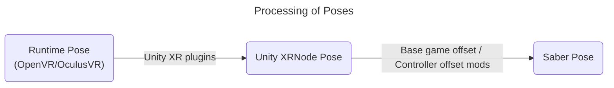

# BeatSaberOffsetMigrator
A simple mod to migrate controller settings between versions.

## The Idea
### The Runtime-to-Saber Offset
Controller poses are read directly from VR runtime, OpenVR at the moment, thus the reading will not be affected by the *internal* offsets done by Unity, Unity plugins and the game devs.
Hence this controller pose is the source of truth.

The offset is then calculated using the controller poses and the in-game saber poses (the menu pointer). This will include the offset done by all the other controller settings mod.

### Applying the Offset
Re-applying the offset is as simple as overwriting the in-game saber pose with (runtime controller pose + offset).

This offset can then be imported by [EasyOffset](https://github.com/Reezonate/EasyOffset) via its universal import feature.

## Requirements
- BSIPA
- BSML
- SiraUtil
- OpenVR API (Only for 1.29.4+ on SteamVR)

## Things to Note
### Limitations
- Only supports SteamVR and OculusVR. Does not support other OpenXR runtimes.
- Not tested with Room offset
- Does not support menu pointer smoothing mods
- Logic only applies in the menu

### Terminology
- **Newer versions**: Refers to versions of the game that uses OpenXR (1.29.4+)
- **Older versions**: Refers to versions of the game before 1.29.4 (1.29.1 and below)

## How To Use
> [!IMPORTANT]  
> Due to the game migrated to OpenXR on 1.29.4+, all base game poses are sampled from Unity's XR plugin. 
> This mean the timing of the mod reading the poses from runtime and using them in game is out of sync.
> 
> To counter this, on newer versions, the mod will add a 10 seconds delay before saving or exporting the offset. 
> This is to give enough time for the player to put or hold still the controller on something stable and not moving.

A typical use case is to migrate the offset from older versions to newer versions (1.29.1 and 1.38.0 will be used as example).

### Record Offset (For example, on 1.29.1)
1. Grab a [release](https://github.com/qe201020335/BeatSaberOffsetMigrator/releases) for your game version and install it
2. Make sure all your controller offset mods and settings are working correctly
3. Disable all menu pointer smoothing mods
4. Make sure the base game Room Offset is all zero
5. Click the `OFFSET HELPER` button found in the main menu
6. You should see the pose of your controllers and in-game sabers
    - On older versions, the "Diff" values should not change as you move your controllers.
    - On newer versions, due to the timing issue mentioned above, moving the controllers will cause the diff values to fluctuate.
7. Press `Save Offset` to save the current offset.

### Restore Offset (For example, on 1.38.0)
1. Grab a [release](https://github.com/qe201020335/BeatSaberOffsetMigrator/releases) for your game version and install it
2. Copy the configuration file from the game you just saved the offset to the game you want to restore the offset
    - The configuration file location is `UserData\BeatSaberOffsetMigrator.json`
    - In the example, copy the file from your 1.29.1 game to your 1.38.0 game
3. Install [EasyOffset](https://github.com/Reezonate/EasyOffset) using your mod installer or manually
4. Disable EasyOffset in the mod settings menu
5. Disable all menu pointer smoothing mods
6. Make sure base-game controller settings and room offset are all zero
7. Click the `OFFSET HELPER` button found on the main menu
8. You should see the pose of your controllers and in-game sabers
   - On older versions, the "Diff" values should not change as you move your controllers.
   - On newer versions, due to the timing issue mentioned above, moving the controllers will cause the diff values to fluctuate.
9. Toggle on the `Apply Offset` option and see if your sabers are in the correct place like before
    - If the offsets are clearly wrong, contact me @qe201020335 on Discord
10. Click the `Export Offset` button and the offset will be exported into EasyOffset 
11. Toggle off the `Apply Offset` option and enable EasyOffset in the mod settings menu
12. In EasyOffset's controller settings menu save the current offset to a profile
13. Uninstall `BeatSaberOffsetMigrator` by deleting `Plugins\BeatSaberOffsetMigrator.dll`

> [!NOTE]  
> It is not recommended to play with this mod installed. All the offset logic only applies in the menu.
>
> Please uninstall this mod once you verified the offset is correctly imported by EasyOffset.
