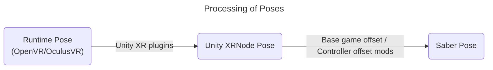

# BeatSaberOffsetMigrator

A mod to migrate controller settings between versions.

Special thanks to [nicoco007](https://github.com/nicoco007) for great help with parts of this mod!

## The Idea
### The Runtime-to-Saber Offset
Controller poses are read directly from VR runtime, OpenVR or OculusVR, thus the reading will not be affected by the *internal* offsets done by Unity, Unity plugins and the game devs.
Hence this controller pose is the source of truth.

The offset is then calculated using the controller poses and the in-game saber poses (the menu pointer). This will include the offset done by all the other controller settings mod.

### Applying the Offset
Re-applying the offset is as simple as overwriting the in-game saber pose with (runtime controller pose + offset).

This offset can then be imported by [EasyOffset](https://github.com/Reezonate/EasyOffset) via its universal import feature.

## Requirements
- BSIPA
- BSML
- SiraUtil
- OpenVR API (Only for 1.29.4+ on SteamVR)

## Things to Note
### Terminology
- **Newer versions**: Refers to versions of the game that uses OpenXR (1.29.4+)
- **Older versions**: Refers to versions of the game before 1.29.4 (1.29.1 and below)

### Limitations
- Only supports SteamVR and OculusVR. Does not support other OpenXR runtimes.
- Not tested with Room offset
- Does not support menu pointer smoothing mods
- Logic only applies in the menu
- On newer versions with OculusVR, re-centering is not supported

### What Runtime Am I Using?
#### 1.29.1 and below
- If SteamVR is running while you are playing, and you can use SteamVR's menu in VR, you are using SteamVR
- If you are playing the Oculus PC version with an Oculus device, and SteamVR is not running, you are using OculusVR
- If you are using `-vrmode oculus`, you are using OculusVR

#### 1.29.4 and above
Due to the game migrating to OpenXR, the runtime used will be the default OpenXR runtime. You can set which runtime is the default:
- SteamVR: SteamVR -> settings -> OpenXR
- OculusVR: Meta Quest Link PC app -> Settings -> General -> OpenXR Runtime
- Other runtimes such as VDXR are not supported.

## How To Use
### Simple Migration
The simple migration only works on higher versions and will only migrate EasyOffset presets made on 1.29.1 or lower. 

See the [advance migration](#how-to-use-advance-migration) for a direction agnostic advance migration.
> [!IMPORTANT]
> The same runtime must be used for both versions of the game to ensure the offset can be migrated correctly. 
> See the [above](#what-runtime-am-i-using) for how to check your runtime.

0. On 1.29.1, save your EasyOffset settings into a preset if not already
1. Copy your 1.29.1 EasyOffset preset over to your higher version game (for example 1.39.1)
2. Install EasyOffset and disable it in the Mods settings menu
3. Select your 1.29.1 EasyOffset preset in the `Offset Helper` menu
4. Enable `Apply Offset` WITHOUT turning on advance migration
5. Go to EasyOffset's settings menu and click `Universal Import`
6. Enable EasyOffset and save the imported offset to a preset
7. Uninstall this mod and have fun! (Delete `Plugins\BeatSaberOffsetMigrator.dll`)

### Record Custom Runtime Offset
1. In the `Offset Helper` menu, turn off `Apply Offset` and enable `Advance Migration`
2. In the `Advance Migration` menu, turn on `Record Runtime Offset`
3. Press `Save Offset` to save the runtime offset
   - ALL the warnings in the advance migration section apply here, see below

## How To Use (Advance Migration)
> [!IMPORTANT]  
> Due to the game migrated to OpenXR on 1.29.4+, all base game poses are sampled from Unity's XR plugin. 
> This means the timing of the mod reading the poses from runtime and using them in-game is out of sync.
> 
> To counter this, on newer versions, the mod will add a 10-second delay before saving or exporting the offset. 
> This is to give enough time for the player to put or hold still the controller on something stable and not moving.

> [!WARNING]
> If you are using Quest, please avoid completely putting the controllers down. They will go to sleep very quickly.
> If they do, the readings will be wrong. Pushing them against your body usually works great.

> [!WARNING]
> On newer versions, if you are using OculusVR, **DO NOT** re-center/reset your view after you have launched the game!

The advance migration will save the Runtime-to-Saber offset and restore it regardless of game versions. 

Most people DO NOT need to use advance migration. The [simple migration](#simple-migration) is enough for most of the cases.

### Record Offset (For example, on 1.29.1)
0. Make sure you have read the [notes](#things-to-note) and [warnings](#how-to-use) above
1. Grab a [release](https://github.com/qe201020335/BeatSaberOffsetMigrator/releases) for your game version and install it
2. Make sure all your controller offset mods and settings are working correctly
3. Disable all menu pointer smoothing mods
4. Make sure the base game Room Offset is all zero
5. Click the `OFFSET HELPER` button found in the main menu
   - Enable on `Advance Migration` if the option is available
6. You should see the pose of your controllers and in-game sabers
   - On older versions, the "Diff" values should not change as you move your controllers.
   - On newer versions, due to the timing issue mentioned above, moving the controllers will cause the diff values to fluctuate.
7. Press `Save Offset` to save the current offset.
   - On 1.29.4+, to ensure the offset is saved accurately, the controllers must be completely still at the end of the 10-second delay.
   - The Quest controllers will go to sleep very quickly after being put down. Please try pushing them against your body instead.

### Verify Offset Is Recorded Correctly
After saving the offset, it is recommended to verify the offset is saved correctly before restoring it on another version.
1. Save the offset if not already, see the steps above
2. Without disabling other controller offset mods or settings, toggle on the `Apply Offset` option
3. Toggle it on and off to see if the sabers position/rotation changes
   - The offset is saved correctly if the sabers do not move as the `Apply Offset` option is toggled 
   - On newer versions, due to the timing issue mentioned above, if the controllers are not physically still, the sabers will move slightly as the `Apply Offset` option is toggled

### Restore Offset (For example, on 1.38.0)
> [!IMPORTANT]
> The same runtime must be used for both versions of the game to ensure the offset can be migrated correctly.
> See the [above](#what-runtime-am-i-using) for how to check your runtime.
0. Make sure you have read the [notes](#things-to-note) and [warnings](#how-to-use) above
1. Grab a [release](https://github.com/qe201020335/BeatSaberOffsetMigrator/releases) for your game version and install it
2. Copy the configuration file from the game you just saved the offset to the game you want to restore the offset
    - The configuration file location is `UserData\BeatSaberOffsetMigrator.json`
    - In the example, copy the file from your 1.29.1 game to your 1.38.0 game
3. Install [EasyOffset](https://github.com/Reezonate/EasyOffset) using your mod installer or manually
4. Disable EasyOffset in the mod settings menu
5. Disable all menu pointer smoothing mods
6. Make sure base-game controller settings and room offset are all zero
7. Click the `OFFSET HELPER` button found on the main menu
   - Enable on `Advance Migration` if the option is available
8. You should see the pose of your controllers and in-game sabers
   - On older versions, the "Diff" values should not change as you move your controllers.
   - On newer versions, due to the timing issue mentioned above, moving the controllers will cause the diff values to fluctuate.
9. Toggle on the `Apply Offset` option and see if your sabers are in the correct place like before
    - If the offsets are clearly wrong, contact me @qe201020335 on Discord
10. Click the `Export Offset` button and the offset will be exported into EasyOffset
    - On 1.29.4+, to ensure the offset is exported accurately, the controllers must be completely still at the end of the 10-second delay. 
    - The Quest controllers will go to sleep very quickly after being put down. Please try pushing them against your body instead.
11. Toggle off the `Apply Offset` option and enable EasyOffset in the mod settings menu
12. In EasyOffset's controller settings menu save the current offset to a profile
13. Uninstall `BeatSaberOffsetMigrator` by deleting `Plugins\BeatSaberOffsetMigrator.dll`

> [!NOTE]  
> It is not recommended to play with this mod installed. All the offset logic only applies in the menu.
>
> Please uninstall this mod once you verified the offset is correctly imported by EasyOffset.
