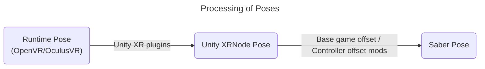

# BeatSaberOffsetMigrator
A simple mod to migrate controller settings between versions. 

> [!NOTE]  
> Currently only supports SteamVR. OculusVR support is WIP.

## The Idea
### The Runtime-to-Saber Offset
Controller poses are read directly from VR runtime, OpenVR at the moment, thus the reading will not be affected by the *internal* offsets done by Unity, Unity plugins and the game devs.
Hence this controller pose is the source of truth.

The offset is then calculated using the controller poses and the in-game saber poses (the menu pointer). This will include the offset done by all the other controller settings mod.

### Applying the Offset
Re-applying the offset is as simple as overwriting the in-game saber pose with (controller pose + offset).

This offset can then be imported by [EasyOffset](https://github.com/Reezonate/EasyOffset) via its universal import feature.

## Requirements
- BSIPA
- BSML
- SiraUtil
- OpenVR API (Only for 1.29.4+)

## How To Use
### Record Offset (For example, on 1.29.1)
1. Grab a [release](https://github.com/qe201020335/BeatSaberOffsetMigrator/releases) for your game version and install it
2. Make sure all your controller offset mods and settings are working correctly
3. Disable all menu pointer smoothing mods
4. Make sure the base game Room Offset is all zero
5. Click the `OFFSET HELPER` button found on the main menu
6. You should see the pose of your controllers and in-game sabers
    - The "Diff" values should stay the same and not change as you move your controller slowly.
7. Press `Save Offset` to save the current offset.

### Restore Offset (For example, on 1.37.3)
1. Grab a [release](https://github.com/qe201020335/BeatSaberOffsetMigrator/releases) for your game version and install it
2. Copy the configuration file from the "source" game to the "target" game
    - The configuration file location is `UserData\BeatSaberOffsetMigrator.json`
    - "Source" game is the one you use to save the offset from
    - "Target" game is the one you want to migrate your offset to
3. Install [EasyOffset](https://github.com/Reezonate/EasyOffset) 
4. Disable EasyOffset in the mod settings menu
5. Disable all menu pointer smoothing mods
6. Make sure base-game controller settings and room offset are all zero
7. Click the `OFFSET HELPER` button found on the main menu
8. You should see the pose of your controllers and in-game sabers
    - The "Diff" values should stay the same and not change as you move your controller slowly.
    - Due to some small latency, the Diff values may vary ~0.1 as you move your controller.
9. Toggle on the `Apply Offset` option and see if your sabers are in the correct place like before
    - If the offsets are clearly wrong, contact me @qe201020335 on Discord
10. In the EasyOffset mod settings menu click the `Universal Import` button to import the offset and enable EasyOffset
    - See EasyOffset's [readme](https://github.com/Reezonate/EasyOffset?tab=readme-ov-file#from-any-source) for details
11. In EasyOffset's controller settings menu save the current offset to a profile
12. Toggle off the `Apply Offset` option in the `OFFSET HELPER` menu
13. Uninstall `BeatSaberOffsetMigrator` by deleting `Plugins\BeatSaberOffsetMigrator.dll`

> [!NOTE]  
> It is not recommended to play with this mod installed. All the offset logic only applies in the menu.
>
> Please uninstall this mod once you verified the offset is correctly imported by EasyOffset.
