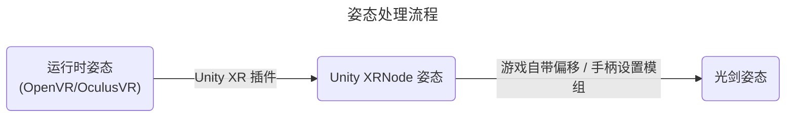

# BeatSaberOffsetMigrator

一个用于在版本之间迁移手柄Offset设置的模组。

特别感谢 [nicoco007](https://github.com/nicoco007)，为这个模组的一部分提供极大帮助！

## [点我](#简单迁移)查看如何使用

## 原理概念
### 运行时到光剑的姿态偏移量
手柄的姿态（Pose）直接从 VR 运行时（OpenVR 或 OculusVR）中读取，因此读取的姿态不会受到 Unity、Unity 插件或游戏开发者的 *内部* 偏移影响。
因此，这种控制器姿态是可靠的来源。

总偏移量可以通过手柄姿态和游戏内光剑姿态计算得出。这包括了所有其他手柄设置模组添加的偏移量。

### 添加偏移
重新应用偏移非常简单，只需将游戏内光剑姿态覆盖为（运行时控制器姿态 + 偏移）

该偏移量可以通过 [EasyOffset](https://github.com/Reezonate/EasyOffset) 的通用导入功能进行导入。

## 模组依赖
这些都可以通过模组安装器安装。
- BSIPA
- BSML
- SiraUtil
- OpenVR API (仅适用于1.29.4版本以上SteamVR玩家)

## 注意事项
### 术语
- **新版本**: 指使用 OpenXR 的游戏版本（1.29.4+）
- **旧版本**: 指 1.29.4 之前的游戏版本（1.29.1 及以下）

### 限制
- 仅支持 SteamVR 和 OculusVR，不支持其他 OpenXR 运行时
- 未在“房间偏移”（Room Offset）环境下测试
- 不支持菜单指针平滑模组
- 手柄偏移逻辑仅在游戏菜单中生效
- 在新版本的 OculusVR 环境中，不支持重置视野

### 我正在使用哪个运行时？
#### 1.29.1 及以下版本
- 如果运行游戏时在 VR 中可以使用 SteamVR 的菜单，那么您正在使用 SteamVR
- 如果您使用 Oculus 设备玩 Oculus PC 版本的游戏，并且未运行 SteamVR，那么您正在使用 OculusVR
- 如果使用了 `-vrmode oculus` 参数，那么您正在使用 OculusVR

#### 1.29.4 及以上版本
由于游戏迁移到了 OpenXR，所使用的运行时将是默认的 OpenXR 运行时。您可以设置默认的运行时：
- SteamVR：SteamVR -> 设置 -> OpenXR
- OculusVR：Meta Quest Link 桌面应用 -> 设置 -> 通用 -> OpenXR Runtime
- 不支持其他运行时（例如 VDXR）。

## 如何使用
### 简单迁移
简单迁移仅适用于新版本，并且只会迁移在 1.29.1 或更低版本中创建的 EasyOffset 预设。

有关方向无关的高级迁移，请参阅[高级迁移](#如何使用-高级迁移)部分。
> [!IMPORTANT]  
> 两个游戏版本必须使用相同的运行时，以确保偏移可以正确迁移。
> 请参阅[上文](#我正在使用哪个运行时)了解如何检查您的运行时。

强烈建议安装[社区翻译](https://github.com/Auros/SiraLocalizer/releases)模组以查看游戏内的中文模组界面

0. 在 1.29.1 上，将您的 EasyOffset 设置保存到一个预设中（如果尚未保存）。
   - 如果您之前没有使用 EasyOffset，您可以将您的设置导入到 EasyOffset 中，然后将其保存为一个预设。
   - 详见 [EasyOffset 文档](https://github.com/Reezonate/EasyOffset?tab=readme-ov-file#import)
1. 将您的 1.29.1 EasyOffset 预设复制到新版本的游戏中（例如 1.39.1）。
   - 预设文件夹在 `UserData\EasyOffset\Preset\`
2. 下载并安装本模组的 [最新版本](https://github.com/qe201020335/BeatSaberOffsetMigrator/releases/latest)
3. 安装 EasyOffset 并在模组设置菜单中禁用它。
4. 在 `偏移助手` 菜单中选择您的 1.29.1 EasyOffset 预设。
5. 启用 `应用偏移`，但不要开启高级迁移选项。
6. 前往 EasyOffset 的设置菜单并点击 `Universal Import`。
7. 启用 EasyOffset 并将导入的偏移保存到一个预设中。
8. 卸载此模组然后爽玩！（删除 `Plugins\BeatSaberOffsetMigrator.dll` 和 `UserData\BeatSaberOffsetMigrator`）

### 记录自定运行时偏移
1. 在 `偏移助手` 菜单中，关闭 `应用偏移` 并启用 `高级迁移`。
2. 在 `高级迁移` 菜单中，开启 `记录运行时偏移`。
3. 点击 `保存偏移` 来保存运行时偏移。
   - 高级迁移部分中的所有警告同样适用于此，请参见下文。

## 如何使用 (高级迁移)
> [!IMPORTANT]  
> 游戏在 1.29.4+ 版本迁移到了 OpenXR，因此所有游戏内姿态都由 Unity 的 XR 插件采样得到。
> 这意味着模组从运行时读取姿态并在游戏中使用它们的时间是不同步的。
> 
> 为了解决这个问题，在新版本中，模组将在保存或导出偏移之前添加 10 秒的延迟。 
> 这为玩家提供足够时间将控制器放置在稳定且不移动的位置。

> [!WARNING]
> 如果使用的是 Quest，请避免完全放下手柄，因为它们会很快地进入休眠状态。
> 如果它们进入休眠状态，读取的结果会出错。将控制器靠在身体上通常是个好方法。

> [!WARNING]
> 在新版本中，如果使用的是 OculusVR，请勿在启动游戏后重新定位/重置视角！

高级迁移将保存 运行时到光剑 的偏移，并在不同游戏版本间恢复它。

**大多数人不需要使用高级迁移。[简单迁移](#简单迁移)已经足以应对大多数情况, _即使您之前没有使用 EasyOffset_。**

强烈建议安装[社区翻译](https://github.com/Auros/SiraLocalizer/releases)模组以查看游戏内的中文模组界面

### 记录偏移（例如，在 1.29.1）
0. 请确保已阅读上方的[注意事项](#注意事项)和[警告](#如何使用)
1. 从 [Releases](https://github.com/qe201020335/BeatSaberOffsetMigrator/releases) 下载适合游戏版本的文件并安装
2. 确保所有手柄偏移模组和手柄设置正常工作
3. 禁用所有菜单指针平滑模组
4. 确保游戏的房间偏移设置全为零
5. 点击主菜单中的 `偏移助手` 按钮
    - 如果可用，启用 `高级迁移`
6. 手柄和游戏内光剑的姿态数值会被显示出来
    - 在旧版本中，当您移动控制器时，“差值”（Diff）不会变化。
    - 在新版本中，由于上述的时间同步问题，移动手柄会导致差值波动。
7. 点击 `保存偏移` 按钮保存当前偏移
    - 在 1.29.4+ 版本中，为确保偏移准确保存，控制器必须在 10 秒延迟结束时完全静止。
    - Quest 控制器在被放下后会很快进入休眠状态。将控制器靠在身体上通常是个好方法。

### 验证偏移是否正确保存
保存偏移后，建议在另一个版本中还原偏移之前验证其是否已正确保存。
1. 如果尚未保存偏移，请参照上述步骤进行保存。
2. 在不禁用其他手柄偏移模组或设置的情况下，启用 `应用偏移` 选项。
3. 切换启用和禁用 `应用偏移` 选项，观察光剑的位置/旋转是否发生变化：
   - 如果光剑在切换 `应用偏移` 选项时未移动，则偏移保存正确。
   - 在新版本中，由于上述的时间同步问题，如果手柄现实中不是静止的，切换 `应用偏移` 选项时光剑可能会轻微移动。

### 还原偏移（例如，在 1.38.0）
> [!IMPORTANT]  
> 两个游戏版本必须使用相同的运行时，以确保偏移可以正确迁移。
> 请参阅[上文](#我正在使用哪个运行时)了解如何检查您的运行时。
0. 请确保已阅读上方的[注意事项](#注意事项)和[警告](#如何使用)
1. 从 [Releases](https://github.com/qe201020335/BeatSaberOffsetMigrator/releases) 下载适合游戏版本的文件并安装
2. 将配置文件从保存偏移的游戏复制到需要恢复偏移的游戏中：
    - 配置文件位置为 `UserData\BeatSaberOffsetMigrator.json`
    - 在此例中，将文件从 1.29.1 游戏复制到 1.38.0 游戏
3. 使用模组安装器或手动安装 [EasyOffset](https://github.com/Reezonate/EasyOffset)
4. 在模组设置菜单中禁用 EasyOffset
5. 禁用所有菜单指针平滑模组
6. 确保游戏的房间偏移设置和游戏自带的手柄设置全为零
7. 点击主菜单中的 `偏移助手` 按钮
    - 如果可用，启用 `高级迁移`
8. 手柄和游戏内光剑的姿态数值会被显示出来
    - 在旧版本中，当您移动控制器时，“差值”（Diff）不会变化。
    - 在新版本中，由于上述的时间同步问题，移动手柄会导致差值波动。
9. 打开 `保存偏移` 选项，检查光剑是否处于像原来一样的正确位置
10. 点击 `导出偏移` 按钮，将偏移导出到 EasyOffset
    - 在 1.29.4+ 版本中，为确保偏移准确导出，控制器必须在 10 秒延迟结束时完全静止。
    - Quest 控制器在被放下后会很快进入休眠状态。将控制器靠在身体上通常是个好方法。
11. 关闭 `应用偏移` 选项，并在模组设置菜单中启用 EasyOffset
12. 在 EasyOffset 的手柄设置菜单中，将当前的偏移设置保存到一个配置文件。
13. 删除 `Plugins\BeatSaberOffsetMigrator.dll` 文件以卸载 `BeatSaberOffsetMigrator`

> [!NOTE]  
> 不推荐在安装此模组的情况下打谱。所有偏移逻辑仅在菜单生效。
>
> 请在确认偏移已被 EasyOffset 正确导入后卸载此模组。
