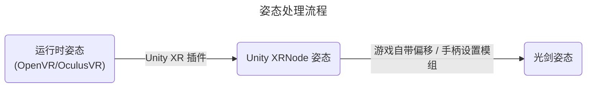

# BeatSaberOffsetMigrator

一个用于在版本之间迁移手柄Offset设置的模组。

## 原理概念
### 运行时到光剑的姿态偏移量
手柄的姿态（Pose）直接从 VR 运行时（OpenVR 或 OculusVR）中读取，因此读取的姿态不会受到 Unity、Unity 插件或游戏开发者的 *内部* 偏移影响。
因此，这种控制器姿态是可靠的来源。

总偏移量可以通过手柄姿态和游戏内光剑姿态计算得出。这包括了所有其他手柄设置模组添加的偏移量。

### 添加偏移
重新应用偏移非常简单，只需将游戏内光剑姿态覆盖为（运行时控制器姿态 + 偏移）

该偏移量可以通过 [EasyOffset](https://github.com/Reezonate/EasyOffset) 的通用导入功能进行导入。

## 模组依赖
- BSIPA
- BSML
- SiraUtil
- OpenVR API (仅适用于1.29.4版本以上SteamVR玩家)

## 注意事项
### 术语
- **新版本**: 指使用 OpenXR 的游戏版本（1.29.4+）
- **旧版本**: 指 1.29.4 之前的游戏版本（1.29.1 及以下）

### 限制
- 仅支持 SteamVR 和 OculusVR，不支持其他 OpenXR 运行时
- 未在“房间偏移”（Room Offset）环境下测试
- 不支持菜单指针平滑模组
- 手柄偏移逻辑仅在游戏菜单中生效
- 在新版本的 OculusVR 环境中，不支持重置视野

## 如何使用
> [!IMPORTANT]  
> 游戏在 1.29.4+ 版本迁移到了 OpenXR，因此所有游戏内姿态都由 Unity 的 XR 插件采样得到。
> 这意味着模组从运行时读取姿态并在游戏中使用它们的时间是不同步的。
> 
> 为了解决这个问题，在新版本中，模组将在保存或导出偏移之前添加 10 秒的延迟。 
> 这为玩家提供足够时间将控制器放置在稳定且不移动的位置。
>
> 如果使用的是 Quest，请避免完全放下手柄，因为它们会很快地进入休眠状态。
> 如果它们进入休眠状态，读取的结果会出错。将控制器靠在身体上通常是个好方法。

> [!WARNING]
> 在新版本中，如果使用的是 OculusVR，请勿在启动游戏后重新定位/重置视角！

从旧版本迁移偏移到新版本是本模组的典型用例（以 1.29.1 和 1.38.0 为例）

### 记录偏移（例如，在 1.29.1）
1. 从 [Releases](https://github.com/qe201020335/BeatSaberOffsetMigrator/releases) 下载适合游戏版本的文件并安装
2. 确保所有手柄偏移模组和手柄设置正常工作
3. 禁用所有菜单指针平滑模组
4. 确保游戏的房间偏移设置全为零
5. 点击主菜单中的 `OFFSET HELPER` 按钮
6. 手柄和游戏内光剑的姿态数值会被显示出来
    - 在旧版本中，当您移动控制器时，“差值”（Diff）不会变化。
    - 在新版本中，由于上述的时间同步问题，移动手柄会导致差值波动。
7. 点击 `Save Offset` 按钮保存当前偏移

### 还原偏移（例如，在 1.38.0）
1. 从 [Releases](https://github.com/qe201020335/BeatSaberOffsetMigrator/releases) 下载适合游戏版本的文件并安装
2. 将配置文件从保存偏移的游戏复制到需要恢复偏移的游戏中：
    - 配置文件位置为 `UserData\BeatSaberOffsetMigrator.json`
    - 在此例中，将文件从 1.29.1 游戏复制到 1.38.0 游戏
3. 使用模组安装器或手动安装 [EasyOffset](https://github.com/Reezonate/EasyOffset)
4. 在模组设置菜单中禁用 EasyOffset
5. 禁用所有菜单指针平滑模组
6. 确保游戏的房间偏移设置和游戏自带的手柄设置全为零
7. 点击主菜单中的 `OFFSET HELPER` 按钮
8. 手柄和游戏内光剑的姿态数值会被显示出来
    - 在旧版本中，当您移动控制器时，“差值”（Diff）不会变化。
    - 在新版本中，由于上述的时间同步问题，移动手柄会导致差值波动。
9. 打开 `Apply Offset` 选项，检查光剑是否处于像原来一样的正确位置
10. 点击 `Export Offset` 按钮，将偏移导出到 EasyOffset
11. 关闭 `Apply Offset` 选项，并在模组设置菜单中启用 EasyOffset
12. 在 EasyOffset 的手柄设置菜单中，将当前的偏移设置保存到一个配置文件。
13. 删除 `Plugins\BeatSaberOffsetMigrator.dll` 文件以卸载 `BeatSaberOffsetMigrator`

> [!NOTE]  
> 不推荐在安装此模组的情况下打谱。所有偏移逻辑仅在菜单生效。
>
> 请在确认偏移已被 EasyOffset 正确导入后卸载此模组。
